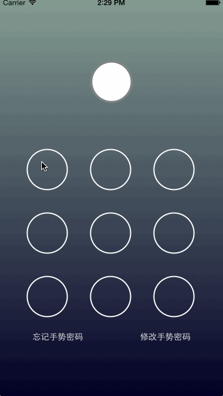

GesturePassword4Swift
=====================

##简介

Swift实现手势密码

参考[GesturePassword](https://github.com/smilingxinyi/GesturePassword)采用Swift语言实现的手势密码

采用keychain做数据持久化,keychain的swift库采用 https://github.com/jrendel/KeychainWrapper

##使用方法

下载后将GesturePassword下的swift文件拷贝至工程

具体使用方法参考`GesturePasswordControllerViewController.swift`

第一次的时候会两次验证密码

以后便会以这个密码进行确认

清空密码可以调用 - clear

- verify 验证手势密码在这里

- reset 重置手势密码在这 （第一次回调用到这里进行第一次设置)

